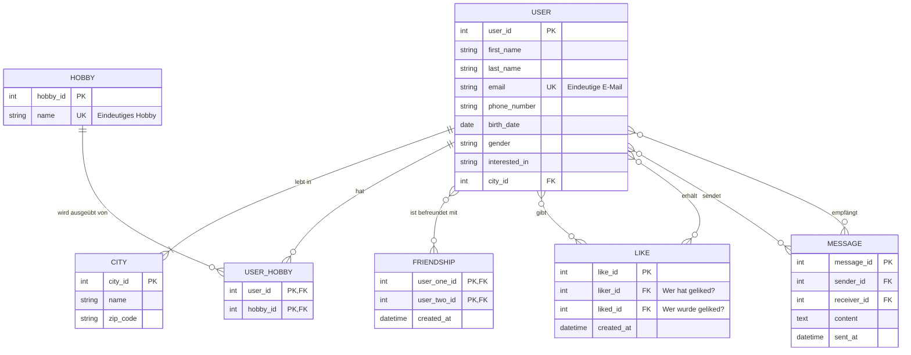

# Datenmigration & Datenbank-Design für Let's Meet GmbH

Dieses Repository dient der Analyse, dem Entwurf und der Migration der Bestandsdaten für die Dating-App der Let's Meet GmbH.

## 1. Hintergrund & Ausgangslage

Unsere Kundin, die Let’s Meet GmbH, hat uns mit der Weiterentwicklung ihrer Dating-App beauftragt. Nach einer problematischen Trennung vom vorherigen IT-Dienstleister besteht kein Zugriff mehr auf die produktiven Datenbanken. Die gesamte Datenbasis liegt uns in heterogener Form vor und muss in ein neues, robustes System überführt werden.

Die Kernaufgabe unseres Teams ist die Konzeption und Umsetzung der Datenmigration. Die eigentliche App-Entwicklung wird von einem separaten Team betreut.

## 2. Projektziele & Aufgaben unseres Teams

Die Kundin legt größten Wert auf eine saubere Konzeption und nachvollziehbare Dokumentation, um zukünftige Probleme zu vermeiden.

Unsere Hauptaufgaben sind:

1. **Datenanalyse:** Eingehende Analyse der bereitgestellten Datenquellen zur Identifizierung von Entitäten, Attributen und Beziehungen.
2. **Konzeptueller Entwurf:** Erstellung eines ausgefeilten konzeptuellen Datenmodells (z.B. als ER-Diagramm), das als Diskussionsgrundlage mit der Kundin dient.
3. **Logischer Entwurf:** Überführung des konzeptuellen Modells in ein logisches Datenmodell (relationales Schema).
4. **Datenbankimplementierung:** Erstellung des physischen Datenbankschemas in PostgreSQL mittels DDL-Skripten.
5. **Datenmigration:** Entwicklung von Skripten zum Import, zur Bereinigung und zur Transformation der Daten aus allen Quellen in die neue PostgreSQL-Datenbank.
6. **Dokumentation:** Lückenlose Dokumentation aller Entwurfsphasen und Zwischenschritte in Markdown-Dateien.

## 3. Datenquellen

Die zu migrierenden Daten stammen aus drei unterschiedlichen Quellen:

* **Excel-Datei (`.xlsx`):** Haupt-Dump der ehemaligen relationalen Datenbank. Enthält die Kern-Entitäten wie Nutzerprofile, Stammdaten etc.
* **MongoDB-Backup:** NoSQL-Datenbank-Export, der **Likes** und **Nachrichten** aus einer anderen App enthält.
* **XML-Datei (`.xml`):** Enthält strukturierte Daten zu den **Hobbys** der Nutzer.

## 4. Technologie-Stack & Zielsystem

* **Zieldatenbank:** PostgreSQL
* **Laufzeitumgebung:** Docker
* **Versionierung:** Git

Der PostgreSQL-Server wird über die `docker-compose.yml`-Datei in diesem Repository konfiguriert und bereitgestellt.

## 5. Entity Relationship Model

## 6. Entity Relationship Diagram

